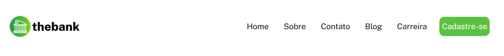
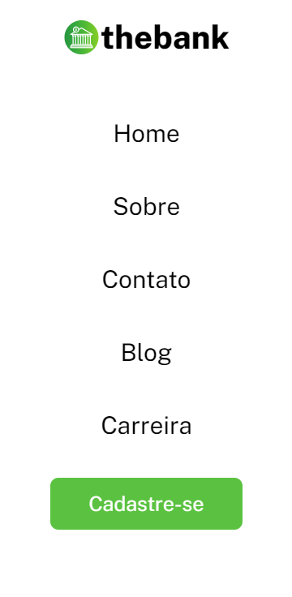
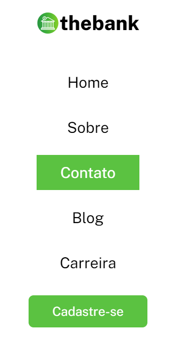

Este é o QUARTO exercício de nível avançado (HTML e CSS) do curso de Desenvolvedor Web Full stack da Dev em Dobro.

"Você está prestes fazer um exercício de HTML e CSS avançado para praticar o que aprendeu até aqui! Use os conhecimentos que aprendeu nos módulos de HTML e CSS pra resolvê-lo da melhor forma, leia atentamente a descrição de cada tarefa." - Dev em Dobro.

Os materiais de apoio para a realização do projeto foram disponibilizados no Figma:

https://www.figma.com/file/DYk9DZr6urB9MZ4iNt1a61/Desafio-HTML-%2B-CSS?type=design&node-id=2-5&mode=design&t=BkUbrbHkxKyFo2Ra-0

<head>
A família da fonte foi obtida no Google Fonts (Public-sans) em que os pesos 300, 400 e 800 foram baixados para uso, conforme indicado. O link para a fonte foi adicionado no HTML5, como indicado no próprio Google Fonts e definido o tipo de fonte do projeto no arquivo CSS3 de estilo.

Além da fonte, também foram linkados os arquivos CSS3 e adicionado o título.
Foram separados três arquivos para estilização: o reset.css; style.css e responsive.css.

</head>

<body>

No corpo do HTML5 foi criada a seção principal com um <header>, pois se trata de um cabeçalho, estruturada com uma ancora, contendo um texto h2 e o logo correspondente, e um menu de navegação, usando a tag <nav>.

</body>

//CSS3

A partir das classes e tags do HTML, os arquivos CSS puderam caracterizar cada um.

No reset retirou-se as características automáticas de margin, padding e adicinou-se um  a fonte, que será usada em todo o cabeçalho, ou seja, características fixas na página.

Os elementos foram centralizados utilizando os princípios do flexbox e o space-between para que  o logo e o nome do banco ficassem separados do menu de navegação.

Foi utilizada a pseudo-classe hover para adicionar o efeito de mudança de cor de fundo para os itens do menu de navegação.

A responsividade dessa página foi obtida usando propriedades flex (display flex) em arquivo css separadamente. Foi adicionada uma @mediaquery com o breakpoint a partir do tamanho de tela de 700px de largura de página, mudando a direção do cabeçalho de linha para colunas e ajustando tamanho de fonte, peso de fonte, efeitos do mouse e tamanho e cor do fundo.

//CSS

Exemplo de como ficou a página em telas desktop:

Exemplo de como ficou a página em telas mobile:

Exemplo do efeito de sombreamento com o passar do mouse:

Obrigada por acompanhar o início do meu trabalho. 
Att, Lívia.